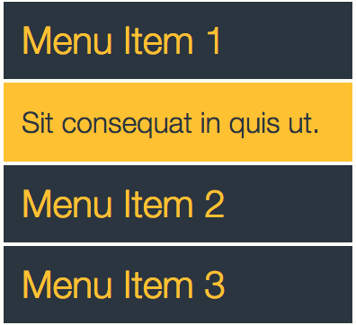
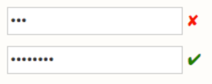

# jQuery

1. Open the file: jquery.html and solve the following:

	* Include the jQuery library in the file
	* Write an expression using jQuery that targets all `h1` elements and makes their font-color green
	* Get the body element and turn its background red
	* Get the element with the id "first" and increase its font-size to 36px
	* Get all elements with the class "list" and add a black border to them
	* Get all `li` elements within `ul` elements and bold them
	* Get all p elements coming immediately after an h1 element and makes them green
	* Get the element with the id of "hide-this" and change its display property to 'none'
	* Get the element with the id of "change-this" and change its text to a new sentence
	* Append more text to the 'change-this' element
	* Append an extra paragraph to the 'change-this' element
	* Replace #replace-this's contents with two new paragraph tags with content included
	* Change text in the li tags in the #second div
	* Then append more text to all li's in the #second div
	* Create a third div with id #third in the body
	* Target the #third div and append an ordered list with three list elements inside

# Events

2. Create an accordion style menu similar to the one below using click events and jQuery slide effects. Clicking on Menu 1, opens that yellow div, clicking on Menu 2, opens one under Menu 2 and closes the first one, and so on.

	
	
	
3. Create a password input field such that once the number of characters entered reaches 8 or more, a green check ✔ is displayed next to the field, otherwise a red cross ✘ is shown.

    
    
